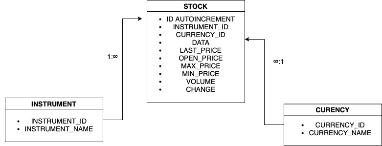
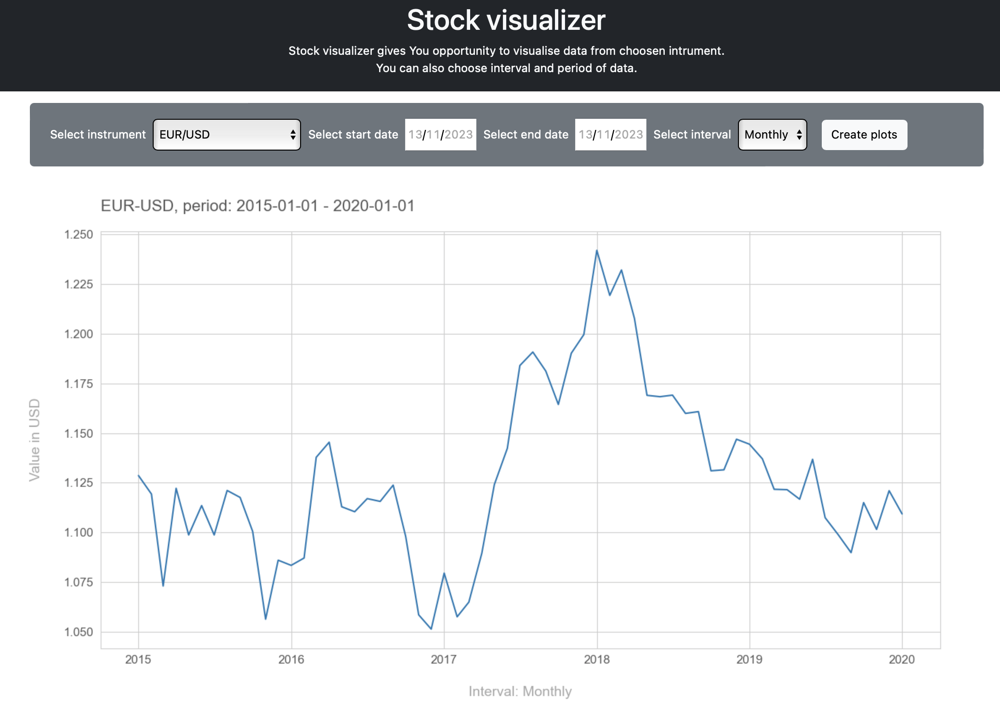

# STOCK VISUALISER

## Table of contents

* About project
* Database structure
* Site

## About project

Stock visualiser is a site built with Flask to visualise stock data.

In order to visualize the data, a scrapper was built to extract data from investing.com. The raw data was processed using Python and then saved in an SQLlite database.

The website was built using Flask, which connects to the database, retrieves the user's selections and visualizes the data on the website.

## Database structure

## Site 

User can choose:

* Instrument. Currently avalaible:
  * EUR/USD
  * GBP/USD
  * EUR/PLN
  * USD/CAD
  * PLATINUM
  * GOLD
  * SILVER
  * COPPER
  * ACTIVISION INC.
  * CD PROJEKT RED S.A.
  * NINTENDO LTD.
  * 11BIT STUDIOS S.A.
* Start date
  * From 2010 to 2022.
* End date
  * From 2010 to 2022.
* Interval
  * Daily
  * Weekly
  * Monthly

Button named ,,Create plots" generates plot using matplotlib library, saves is to static/images and then displays on site.

## Limitations

The current version only gives opportunity to visualise one instrument at a time and also number of avalaible instruments is limited.
